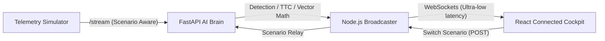

# 🚗 RoadSentinel: The Connected Cockpit

**RoadSentinel** is a high-performance, real-time spatial awareness system designed to intercept wrong-way drivers and predict imminent collisions. Developed for high-stakes road safety, it operates on pure geospatial physics, fundamentally improving detection speed and accuracy without the computational overhead of heavy computer vision models.

---

## ⚡ Killer Features

*   **🎮 Reality Scenario Switcher**: A world-first demo tool. Toggle between **Normal Traffic**, **Ghost Driver (Intruder)**, and **False Positive Tests** (U-turns/Slow-mo) on-the-fly to prove system reliability.
*   **📐 Vector Physics Collision Prediction**: Advanced mathematical modeling computes **Relative Velocity vectors** in real-time. Emits sub-second warnings for impending head-on crashes ($T = d / v_{rel}$) with interactive yellow visual tethers.
*   **🛣️ Topological Road Awareness**: The AI Brain cross-references live telemetry against OpenStreetMap-indexed road graphs. It understands one-way constraints, bearing modulo thresholds, and topological directions.
*   **📉 Confidence Evolution Engine**: Uses temporal filtering to ramp up alert confidence. Watch live **Sparkline Charts** visualize the detection score rising until it trips the "Threat" threshold.
*   **🕵️ False Positive Immunization**: Built-in "Speed Gates" ($V < 2m/s$) and "U-Turn Logic" ($150^\circ$ rapid flip filtering) prevent traffic noise from triggering false alarms.
*   **🛰️ Motion Trail Visualization**: Real-time GPS path-tracking. Normal traffic leaves subtle dashed grey trails, while identified threats leave a persistent **Solid Red Trajectory**, mapping the danger path.

---

## 🏗️ Interactive Architecture



---

## 🚀 Quick Start (Production One-Click)

We have bundled the 4-service infrastructure into a high-performance orchestrator that handles port hygiene and dependency synchronization.

1.  **Activate Environment**:
    ```bash
    call .mahex\Scripts\activate
    ```
2.  **Launch the Cockpit**:
    ```bash
    .\start.bat
    ```

*This script automatically cleans stale ports (5000/5001), boots the Node Broadcaster, the FastAPI Physics Engine, the Vite Dashboard, and the Scenario-Aware Simulator.*

---

## 📊 Evaluation & Demo Scripts

### 1. Live Interactive Demo
Once launched via `start.bat`, open `http://localhost:3000`. 
*   **Step 1**: Observe **Normal Mode** (Safety Baseline).
*   **Step 2**: Click **Ghost Driver**. Watch the system isolate the single intruder, calculate collision time, and draw the red threat radius.
*   **Step 3**: Click **FP Test**. Watch Vehicle 0 perform a slow U-turn and see the system correctly ignore it as a false positive.

### 2. Mathematical Validation (Offline)
To prove the precision of the logic against large datasets:
```bash
python scripts\evaluate.py
```
Outputs statistical benchmarks for `True Positives`, `FP Rate`, `Precision`, and `Recall`.

---

## 🛠️ Build Stack

*   **Brain**: Python 3.10 (FastAPI, Math-modulo, Haversine metrics).
*   **Broadcaster**: Node.js v18 (Express, Socket.io, Node-Fetch Proxy).
*   **Interface**: React 18, Vite, Leaflet.js, Recharts (Sparklines).
*   **Data**: JSON-serialized Road Topology Graphs & Vector Heading Matrices.

---
*Developed as a premier product demonstration for real-time traffic interception & autonomous road safety intervention.*
