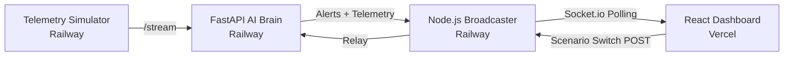

# 🚗 RoadSentinel: The Connected Cockpit

**RoadSentinel** is a production-grade, cloud-deployed real-time spatial awareness system designed to intercept wrong-way drivers and predict imminent collisions. Built for high-stakes road safety, it operates on pure geospatial physics — delivering detection speed and accuracy without the computational overhead of heavy computer vision models.

🌐 **Live Demo**: [https://roadsentinel.vercel.app](https://roadsentinel.vercel.app)  
📦 **Repository**: [https://github.com/Imsachin010/roadsentinel](https://github.com/Imsachin010/roadsentinel)

---

## ⚡ Killer Features

*   **🎮 Reality Scenario Switcher**: Toggle between **Normal Traffic**, **Ghost Driver (Intruder)**, and **False Positive Test** on-the-fly to prove system reliability in front of judges — no restarts needed.
*   **📐 Vector Physics Collision Prediction**: Computes **Relative Velocity vectors** in real-time. Emits sub-second warnings for impending head-on crashes using TTC ($T = d / v_{rel}$) with yellow danger tethers on the map.
*   **🛣️ Topological Road Awareness**: Cross-references live telemetry against OpenStreetMap-indexed road graphs. Understands one-way constraints, bearing modulo thresholds, and topological directions.
*   **📉 Confidence Evolution Engine**: Temporal filtering ramps up alert confidence over time. Live **Sparkline Charts** visualize the detection score rising until it trips the "Threat" threshold.
*   **🕵️ False Positive Immunization**: Built-in "Speed Gates" ($V < 2m/s$) and "U-Turn Logic" ($150°$ rapid flip filtering) prevent traffic noise from triggering false alarms.
*   **🛰️ Motion Trail Visualization**: Normal traffic leaves subtle grey trails. Identified threats leave a persistent **Solid Red Trajectory** — mapping the exact danger path in real time.

---

## 🏗️ Cloud Architecture



### Microservices Breakdown

| Service | Platform | Role |
|---|---|---|
| **Simulator** | Railway | Generates live vehicle telemetry |
| **AI Engine** | Railway | FastAPI — Physics, TTC, Collision Detection |
| **Broadcaster** | Railway | Node.js — WebSocket/Polling relay hub |
| **Dashboard** | Vercel | React + Leaflet.js — Live Connected Cockpit |

---

## 🚀 Local Quick Start (One-Click)

```bash
# 1. Activate the virtual environment
call .mahex\Scripts\activate

# 2. Launch all 4 services simultaneously
.\start.bat
```

> `start.bat` automatically cleans stale ports (5000/5001), boots the Node Broadcaster, FastAPI Engine, Vite Dashboard, and the Scenario-Aware Simulator in the correct order.

Open `http://localhost:3000` to see the cockpit.

---

## ☁️ Cloud Deployment (Production)

### Backend — Railway.app

Deploy 3 separate services from the same GitHub repo with these start commands:

| Service Name | Start Command | Required Env Vars |
|---|---|---|
| `engine` | `/opt/venv/bin/python3 src/detection/main.py` | `BROADCASTER_URL` |
| `broadcaster` | `cd server && npm install && node alert-broadcaster.js` | `ENGINE_URL` |
| `simulator` | `/opt/venv/bin/python3 scripts/simulate_traces.py` | `DETECTION_URL` |

**Environment Variable Wiring:**

```
Simulator  → DETECTION_URL  = https://<engine-url>.railway.app
Engine     → BROADCASTER_URL = https://<broadcaster-url>.railway.app
Broadcaster → ENGINE_URL     = https://<engine-url>.railway.app
```

### Frontend — Vercel

1.  Import the GitHub repo on [vercel.com](https://vercel.com).
2.  Set **Root Directory** to `dashboard`.
3.  Add Environment Variable:
    - `VITE_BROADCASTER_URL` = `https://<broadcaster-url>.railway.app`
4.  Deploy.

---

## 🎬 Live Demo Walkthrough

1.  Open [roadsentinel.vercel.app](https://roadsentinel.vercel.app).
2.  **Normal Mode**: Observe baseline safe traffic with grey motion trails.
3.  **Ghost Driver**: Click the button — watch a red intruder appear, danger radius activates, TTC timer counts down.
4.  **FP Test**: Click the button — a vehicle performs a slow U-turn and the system correctly ignores it as a false positive.

---

## 📊 Mathematical Validation

```bash
python scripts\evaluate.py
```

Outputs: `True Positives`, `False Positive Rate`, `Precision`, `Recall`.

---

## 🛠️ Tech Stack

| Layer | Technology |
|---|---|
| **AI Engine** | Python 3.11, FastAPI, Haversine, Vector Math |
| **Broadcaster** | Node.js, Express, Socket.io, node-fetch |
| **Dashboard** | React 18, Vite, Leaflet.js, Recharts |
| **Build** | Nixpacks, Python venv, npm |
| **Deploy** | Railway (Backend) + Vercel (Frontend) |

---

*Developed as a premier hackathon demonstration for real-time traffic interception & autonomous road safety intervention.*
